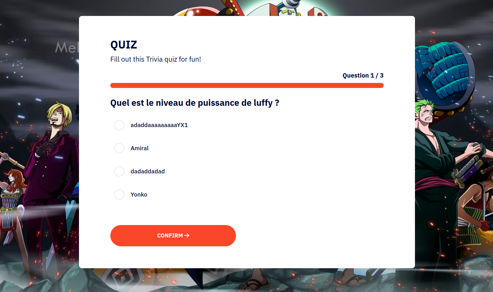

# Quiz App

## Description
Quiz App is a web application that allows users to create and manage quizzes on various topics. You can add questions, define possible answers, and organize quizzes around different themes. The user-friendly interface makes it easy to take quizzes and view results.

### Key Features
- **Create Quizzes**: Build quizzes with custom questions and answer choices.
- **Manage Quizzes**: Add, edit, or delete existing quizzes.
- **Choose Topics**: Select from multiple quiz topics for a more engaging experience.
- **Track Results**: View scores at the end of each quiz and monitor progress.
- **Modern User Interface**: Responsive design powered by Vue3 for a smooth user experience.

## Technologies Used
- **Frontend(/app)**:
    - HTML5
    - CSS3
    - JavaScript
    - Vue3: Used to build a reactive and interactive user interface.

- **Backend (/api)**:
    - **AdonisJS**: Backend framework for managing the API, database, authentication, and more.
    - **Node.js**: JavaScript runtime for running the backend application.

## Example with an Image

Here is an example of a screenshot from the Quiz App:

